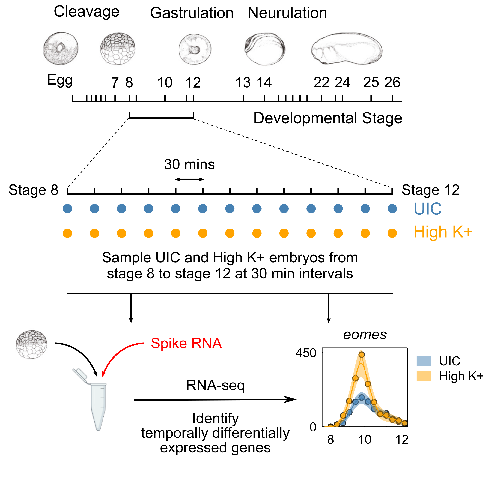

# Gene expression response to membrane depolarisation in *Xenopus* embryos - Figure Notebook

[](https://zenodo.org/badge/latestdoi/506325516)


This julia project contains data and code to generate figures for:

Sempou, E., Kostiuk, V., Zhu, J., Cecilia Guerra, M., Tyan, L., Hwang, W., Camacho-Aguilar, E., Caplan, M. J., Zenisek, D., Warmflash, A., Owens, N., & Khokha, M. K. (2022). Membrane potential drives the exit from pluripotency and cell fate commitment via calcium and mTOR. Nature communications, 13(1), 6681. https://doi.org/10.1038/s41467-022-34363-w


Repository contains source data and code to understand transcriptional response to membrane depolarisation of *Xenopus* embryos in early development through treatment with high K+. Overview of experimental design:



## Prerequistes
Julia >= 1.7, all julia packages and their versions are specified in the included Project.toml and Manifest.toml.

Additionally Python paackage https://requests.readthedocs.io/en/latest/ is within https://github.com/owensnick/Enrichr.jl via https://github.com/JuliaPy/PyCall.jl to interface with Enrichr API (https://maayanlab.cloud/Enrichr/) for gene set enrichments. Ensure Python, requests and PyCall is installed prior to installing this project.

## Installation
```bash
git clone https://github.com/owensnick/KCNH6GenomicsFigures.jl
cd KCNH6GenomicsFigures.jl
julia
```
Within julia activiate the local 
```julia
] # to enter into Pkg mode
activate .
instantiate ## for first time installation
```
To regenerate figures either use jupyter notebook within `notebooks` directory or use script as follows:
```julia
 include("notebooks/genomics.jl")
 ```
This will generate a `figures` folder and will generate all figure panels in `svg` and `png` format.